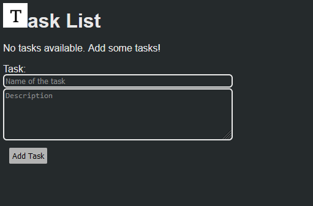
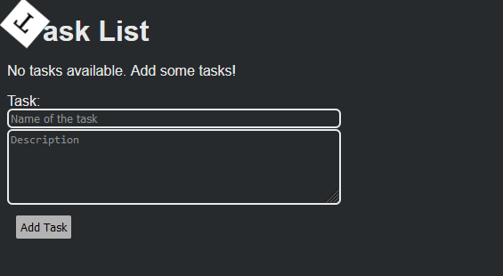
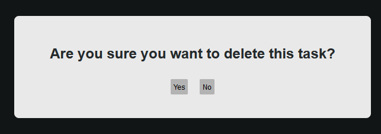
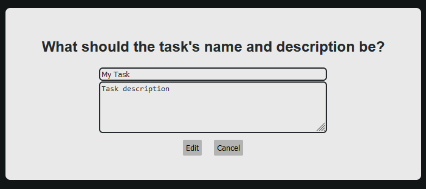
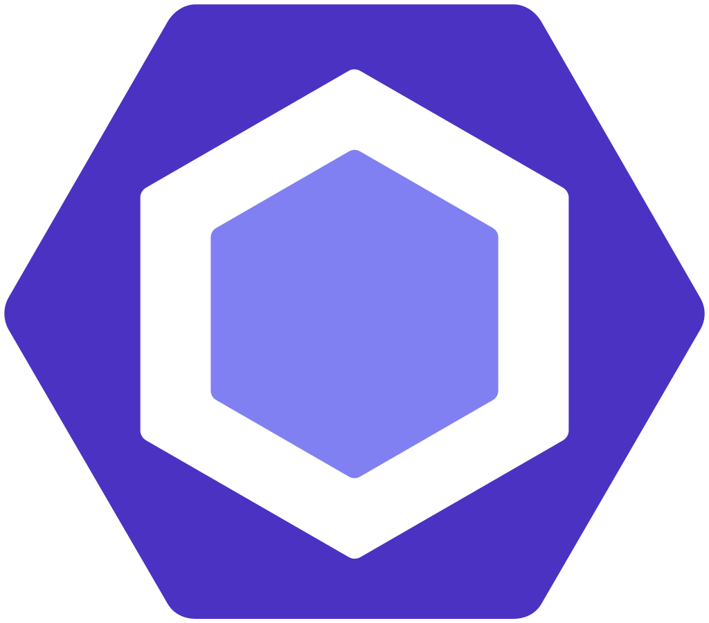

# 

Task List is a lightweight and intuitive task management application built with React. Whether you're organizing your daily to-dos or keeping track of ongoing projects, this app provides a simple and efficient way to manage tasks and their descriptions.

## Features

- Add tasks with optional descriptions.
- View, edit, and delete tasks.
- Tasks are stored locally using `localStorage`.

## Project Structure

- **src/index.tsx**: Entry point for rendering the React app.
- **src/App.tsx**: Main component managing the state and rendering of the task list.
- **src/App.scss**: Stylesheet for the main application.
- **src/components/**: Folder containing React components.
  - **ListElement.tsx**: Component for rendering individual tasks with expandable descriptions.
  - **MessageBoxEdit.tsx**: A prompt to update a task.
  - **MessageBoxDelete.tsx**: A prompt to confirm deleting a task.
  - **Form.tsx**: A form to add or edit tasks.

## Getting Started

1. Clone the repository: `git clone https://github.com/Fox-Coffee/task-list.git`
2. Navigate to the project directory: `cd task-list`
3. Install dependencies: `npm install`
4. Run the app: `npm run dev`

## Usage

 
*Application interface*

- Add tasks using the input form.
- Click "Show More" to view the description and perform actions (edit, delete).
- Tasks and descriptions are stored locally, persisting across sessions.

 

- Tasks can be deleted, showing a pop-up message asking to confirm the deletion.

 

- Tasks can be edited through a form within a pop-up message.

 

## Tech Stack

- __HTML__
- __TypeScript__
- __React__
- __Vite__
- __Sass__
- __ESLint__

## Contributing

Feel free to contribute to the project by opening issues or submitting pull requests.

## License

This project is licensed under the [GNU General Public License v3.0 (GPL-3.0)](LICENSE).

The GPL-3.0 license is a strong copyleft license that ensures the source code remains open and free. It grants users the freedom to view, modify, and distribute the software and any derivative works. Any changes made to the code must be shared under the same license terms.

By using or contributing to this project, you agree to comply with the terms of the GPL-3.0 license.